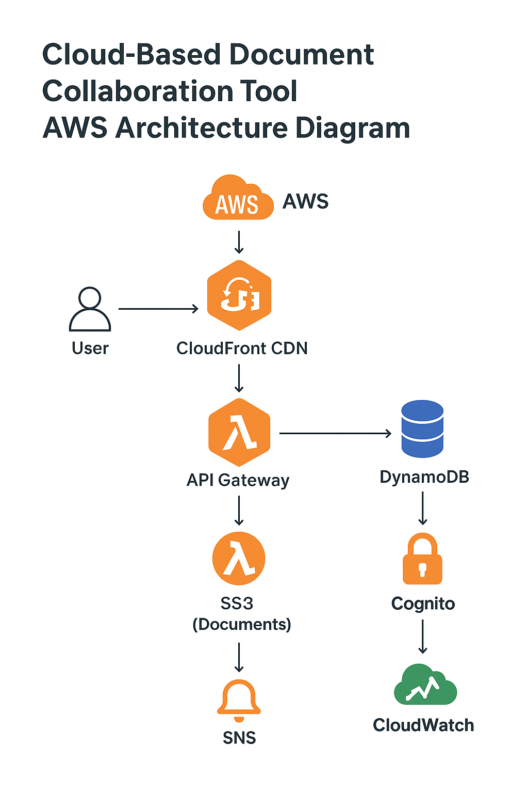

# Docusync: Cloud-Based Document Collaboration Tool



## Overview
Docusync is a secure, cloud-based platform for collaborative document management. It enables multiple users to upload, share, and version documents with robust security and global performance, leveraging AWS serverless architecture.

---

## Features
- **Multi-user document upload, sharing, and versioning**
- **S3**: Stores files with version control enabled
- **DynamoDB**: Stores file metadata and sharing permissions
- **CloudFront**: Optimizes download/upload speed globally
- **Cognito**: Authentication for secure access
- **Lambda**: Tracks changes and sends version history updates
- **SNS**: Alerts users when a document is updated or commented on

---

## AWS Architecture

### Frontend
- **Vue.js SPA** hosted on **Amazon S3**
- **Amazon CloudFront** for global CDN and HTTPS

### Backend (Serverless REST API)
- **Amazon API Gateway**: Exposes REST endpoints
- **AWS Lambda**: Handles CRUD operations and business logic
- **Amazon DynamoDB**: NoSQL database for metadata and permissions
- **Amazon S3**: Stores documents with versioning
- **Amazon Cognito**: User authentication and authorization
- **Amazon SNS**: Sends notifications for updates/comments
- **Amazon CloudWatch**: Logs and monitors API activity
- **AWS IAM**: Manages roles and permissions

---

## Architecture Diagram
```
[User] <-> [CloudFront CDN] <-> [S3 (Vue.js SPA)]
	|
	v
[API Gateway] <-> [Lambda Functions] <-> [DynamoDB]
	|                |
	|                v
	|            [S3 (Documents)]
	|
	v
[Cognito] <-> [IAM]
	|
	v
[SNS] <-> [CloudWatch]
```

---

## Deployment Steps

### 1. Frontend (Vue.js)
- Build the Vue.js app: `npm run build`
- Deploy the `dist/` folder to an S3 bucket
- Configure CloudFront to serve the S3 bucket with HTTPS

### 2. Backend (Serverless API)
- Create DynamoDB tables for metadata and permissions
- Set up S3 bucket with versioning enabled
- Configure Cognito user pool and app client
- Create Lambda functions for CRUD, versioning, notifications
- Set up API Gateway with REST endpoints
- Integrate Lambda with API Gateway and DynamoDB
- Configure SNS topics for notifications
- Set IAM roles for Lambda, API Gateway, and Cognito
- Enable CloudWatch logging for all services

---

## Best Practices
- Use least-privilege IAM roles
- Enable S3 versioning and encryption
- Use DynamoDB indexes for efficient queries
- Secure API Gateway with Cognito authorizers
- Monitor with CloudWatch metrics and alarms

---

## Learning Outcomes
- Design scalable, event-driven serverless applications
- Implement API Gateway with Lambda for stateless execution
- Use DynamoDB as a managed NoSQL database
- Secure APIs with IAM roles and resource policies

---

## Placeholder
- Replace the architecture diagram URL with your own visual asset.
- Add more details to each AWS resource as your implementation progresses.

---

## Getting Started
1. Clone the repo
2. Install dependencies: `npm install`
3. Run locally: `npm run dev`
4. Follow deployment steps above for AWS

---

## License
MIT
